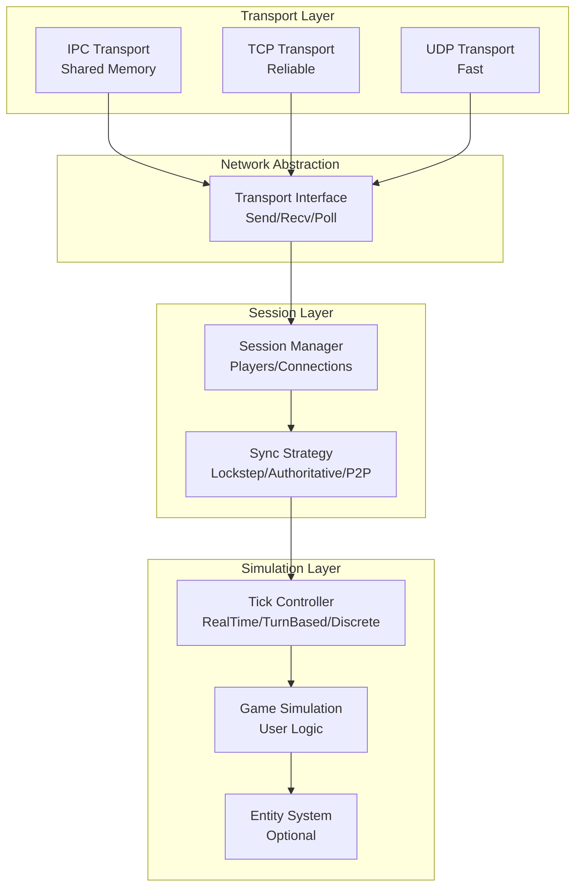

# Odin Game Server Architecture

> **Author**: Nguyen Phi Hung  
> **Status**: Design Document  
> **Last Updated**: 2026-01-02

---

## Overview

A transport-agnostic, genre-agnostic game server framework designed for both single-player (IPC) and multiplayer (TCP/UDP) environments. The architecture supports multiple simulation models—real-time continuous, real-time discrete (RTS-style lockstep), and turn-based—through a pluggable tick system.

---

## Design Principles

1. **Transport Agnostic**: Core simulation has zero knowledge of transport mechanism
2. **Genre Agnostic**: Supports action, RTS, turn-based, and hybrid games
3. **Configurable Determinism**: Optional fixed-point math and seeded RNG
4. **Command-Based**: All state changes flow through serializable commands

---

## Architecture Overview



---

## Core Abstractions

### 1. Transport Interface

```odin
// transport/transport.odin
Transport :: struct {
    vtable: ^Transport_VTable,
    userdata: rawptr,
}

Transport_VTable :: struct {
    send:       proc(t: ^Transport, peer: PeerID, data: []u8) -> bool,
    recv:       proc(t: ^Transport, buffer: []u8) -> (PeerID, int, bool),
    poll:       proc(t: ^Transport, timeout_ms: i32) -> []TransportEvent,
    accept:     proc(t: ^Transport) -> (PeerID, bool),
    connect:    proc(t: ^Transport, address: string) -> (PeerID, bool),
    disconnect: proc(t: ^Transport, peer: PeerID),
    shutdown:   proc(t: ^Transport),
}

PeerID :: distinct u32
PEER_LOCAL  :: PeerID(0)
PEER_SERVER :: PeerID(1)
```

### 2. Tick Mode (Genre Selector)

```odin
// simulation/tick.odin
TickMode :: enum {
    RealTimeContinuous,  // Action games: variable dt, server authoritative
    RealTimeDiscrete,    // RTS: fixed tick rate, lockstep sync
    TurnBased,           // Strategy: explicit turn boundaries
    Hybrid,              // Mix (e.g., simultaneous turns with real-time execution)
}

TickController :: struct {
    mode: TickMode,
    
    // Real-time settings
    tick_rate: u32,           // Ticks per second (0 = continuous)
    accumulator: f64,
    current_tick: u64,
    
    // Turn-based settings
    current_turn: u32,
    current_phase: TurnPhase,
    active_player: PlayerID,
    
    // Common
    paused: bool,
}

TurnPhase :: enum {
    Planning,    // Players issue commands
    Execution,   // Commands resolve
    Cleanup,     // End-of-turn processing
}
```

### 3. Sync Strategy

```odin
// session/sync.odin
SyncStrategy :: enum {
    Authoritative,  // Server decides truth (FPS, action)
    Lockstep,       // All clients must agree (RTS)
    TurnSync,       // Turn completion signals (turn-based)
    P2PPredictive,  // Client prediction with rollback
}

// Interface for sync implementations
Synchronizer :: struct {
    vtable: ^Sync_VTable,
}

Sync_VTable :: struct {
    on_command_received: proc(s: ^Synchronizer, cmd: Command),
    can_advance:         proc(s: ^Synchronizer) -> bool,
    get_confirmed_tick:  proc(s: ^Synchronizer) -> u64,
    broadcast_state:     proc(s: ^Synchronizer, state: []u8),
}
```

---

## Command System (Generic)

```odin
// commands/commands.odin
// Game-agnostic command structure
Command :: struct #packed {
    // Routing
    sequence: u32,
    tick: u64,               // When to execute (0 = immediate)
    player_id: PlayerID,
    
    // Classification
    category: CommandCategory,
    type: u16,               // Game-specific command type
    flags: u16,
    
    // Payload
    target_entity: EntityID,
    target_pos: [3]f32,      // World position (optional)
    data_length: u16,
    data: [MAX_COMMAND_DATA]u8,
}

CommandCategory :: enum u8 {
    // Input (Client -> Server)
    Input       = 0x10,  // Raw input events
    Action      = 0x20,  // Player actions (move, attack, use)
    Order       = 0x30,  // Unit commands (RTS)
    Submit      = 0x40,  // Turn submission (turn-based)
    
    // System (Bidirectional)
    Sync        = 0x80,  // Synchronization messages
    Admin       = 0x90,  // Game control (pause, kick, settings)
    
    // Output (Server -> Client)
    Event       = 0xA0,  // Game events (spawn, death, effects)
    State       = 0xB0,  // State updates
    Turn        = 0xC0,  // Turn notifications
}

MAX_COMMAND_DATA :: 128
```

### Game-Specific Command Registration

```odin
// Example: Register game-specific command types
register_commands :: proc(registry: ^CommandRegistry) {
    // Action game
    register(registry, .Action, 0x01, "Move",   handle_move)
    register(registry, .Action, 0x02, "Attack", handle_attack)
    register(registry, .Action, 0x03, "Use",    handle_use)
    
    // RTS additions
    register(registry, .Order, 0x01, "UnitMove",    handle_unit_move)
    register(registry, .Order, 0x02, "UnitAttack",  handle_unit_attack)
    register(registry, .Order, 0x03, "Build",       handle_build)
    register(registry, .Order, 0x04, "Train",       handle_train)
    
    // Turn-based additions
    register(registry, .Submit, 0x01, "EndTurn",    handle_end_turn)
    register(registry, .Submit, 0x02, "SubmitMove", handle_submit_move)
}
```

---

## Simulation Modes

### Real-Time Continuous (Action/FPS)

```odin
// Variable timestep, server authoritative
continuous_update :: proc(sim: ^Simulation, dt: f64) {
    process_commands(sim)
    update_physics(sim, dt)
    update_entities(sim, dt)
    broadcast_state(sim)  // High frequency
}
```

### Real-Time Discrete (RTS Lockstep)

```odin
// Fixed timestep, deterministic
TICK_DURATION :: 1.0 / 20.0  // 20 ticks/sec

discrete_update :: proc(sim: ^Simulation, dt: f64) {
    sim.accumulator += dt
    
    for sim.accumulator >= TICK_DURATION {
        if !sync_can_advance(sim) { break }  // Wait for all players
        
        execute_commands_for_tick(sim, sim.current_tick)
        tick_simulation(sim)
        sim.current_tick += 1
        sim.accumulator -= TICK_DURATION
    }
}
```

### Turn-Based

```odin
// Explicit turn structure
turn_update :: proc(sim: ^Simulation) {
    switch sim.tick.current_phase {
    case .Planning:
        // Accept commands from active player(s)
        if all_players_submitted(sim) {
            sim.tick.current_phase = .Execution
        }
        
    case .Execution:
        // Resolve commands (may be animated over time)
        if execute_turn_commands(sim) {
            sim.tick.current_phase = .Cleanup
        }
        
    case .Cleanup:
        advance_turn(sim)
        sim.tick.current_phase = .Planning
    }
}
```

### Hybrid (Simultaneous Turns)

```odin
// All players plan simultaneously, resolve together
hybrid_update :: proc(sim: ^Simulation, dt: f64) {
    switch sim.tick.current_phase {
    case .Planning:
        // All players issue commands (time-limited)
        if planning_timer_expired(sim) || all_players_ready(sim) {
            lock_commands(sim)
            sim.tick.current_phase = .Execution
        }
        
    case .Execution:
        // Real-time resolution with fixed dt
        sim.accumulator += dt
        for sim.accumulator >= TICK_DURATION {
            tick_simulation(sim)
            sim.accumulator -= TICK_DURATION
            
            if turn_actions_complete(sim) {
                sim.tick.current_phase = .Planning
                advance_turn(sim)
                break
            }
        }
    }
}
```

---

## Determinism (Optional)

Only required for lockstep multiplayer or replays.

```odin
// math/fixed.odin
// Q16.16 fixed-point (optional, for determinism)
Fixed :: distinct i32

// simulation/rng.odin
// Deterministic RNG (optional)
DeterministicRNG :: struct {
    state: u64,
}

// config flag
SimulationConfig :: struct {
    use_fixed_point: bool,    // For guaranteed cross-platform determinism
    rng_seed: u64,            // For reproducible results
    require_determinism: bool, // Enforce in validation
}
```

---

## Entity System (Optional)

A minimal ECS-like system for games that need many entities.

```odin
// entity/entity.odin
EntityID :: distinct u32
NULL_ENTITY :: EntityID(0)

Entity :: struct {
    id: EntityID,
    flags: EntityFlags,
    owner: PlayerID,
    
    // Transform (always present)
    position: [3]f32,
    rotation: f32,
    
    // Components are stored separately for cache efficiency
}

EntityFlags :: bit_set[EntityFlag]
EntityFlag :: enum {
    Active,
    Visible,
    Networked,   // Sync to clients
    Predictable, // Client can predict
}

// Component storage
EntityManager :: struct {
    entities: []Entity,
    
    // Optional component arrays (parallel to entities)
    health:    []HealthComponent,
    movement:  []MovementComponent,
    combat:    []CombatComponent,
    ai:        []AIComponent,
    
    // Spatial index for queries
    spatial:   SpatialHash,
}
```

---

## File Structure

```
game/
├── main.odin                 # Entry point
├── simulation/
│   ├── simulation.odin       # Core update loop
│   ├── tick.odin             # Tick controller
│   └── config.odin           # Simulation settings
├── commands/
│   ├── commands.odin         # Command definitions
│   ├── registry.odin         # Type registry
│   └── serialization.odin    # Pack/unpack
├── transport/
│   ├── transport.odin        # Interface
│   ├── ipc_transport.odin    # Shared memory
│   ├── tcp_transport.odin    # Reliable network
│   └── udp_transport.odin    # Unreliable network
├── session/
│   ├── session.odin          # Player management
│   ├── sync_authoritative.odin
│   ├── sync_lockstep.odin
│   └── sync_turnbased.odin
├── entity/                   # Optional
│   ├── entity.odin
│   └── spatial.odin
├── math/
│   ├── fixed.odin            # Optional fixed-point
│   └── rng.odin              # Deterministic RNG
├── protocol/
│   └── packets.odin          # Wire format
└── platform/
    └── win32.odin            # OS APIs
```

---

## Configuration Examples

### Action Game (FPS/Platformer)

```odin
config := SimulationConfig{
    tick_mode = .RealTimeContinuous,
    sync_strategy = .Authoritative,
    tick_rate = 0,  // Variable dt
    use_fixed_point = false,
    require_determinism = false,
}
```

### RTS Game

```odin
config := SimulationConfig{
    tick_mode = .RealTimeDiscrete,
    sync_strategy = .Lockstep,
    tick_rate = 20,  // 50ms ticks
    use_fixed_point = true,
    require_determinism = true,
}
```

### Turn-Based Strategy

```odin
config := SimulationConfig{
    tick_mode = .TurnBased,
    sync_strategy = .TurnSync,
    turn_time_limit_sec = 60,
    simultaneous_turns = false,
    require_determinism = false,  // No replay needed
}
```

### Simultaneous-Turn Tactics

```odin
config := SimulationConfig{
    tick_mode = .Hybrid,
    sync_strategy = .TurnSync,
    turn_time_limit_sec = 30,
    simultaneous_turns = true,
    execution_tick_rate = 20,
    require_determinism = true,  // For replay
}
```

---

## Server Modes

```bash
# Single-player (local, no network)
odin_game.exe --mode=local

# Single-player with external renderer (IPC)
odin_game.exe --mode=local --headless --ipc=GameSharedMem

# Dedicated server
odin_game.exe --mode=server --port=7777 --max-players=8

# Client
odin_game.exe --mode=client --server=192.168.1.100:7777
```

---

## Client Integration

### Unreal Engine (C++)

```cpp
// OdinClientTypes.h
// Transport-agnostic command structure
struct FOdinCommand {
    uint32 Sequence;
    uint64 Tick;
    uint8 PlayerId;
    uint8 Category;
    uint16 Type;
    uint16 Flags;
    uint32 TargetEntity;
    float TargetPos[3];
    uint16 DataLength;
    uint8 Data[128];
};

// Usage same regardless of IPC or network
class UOdinClientSubsystem {
    void SendCommand(const FOdinCommand& Cmd);
    bool ReceiveCommand(FOdinCommand& OutCmd);
};
```

### C++ Simulator

```cpp
// client_sim/main.cpp
// Connect via IPC or TCP based on args
Transport* transport = args.use_network 
    ? create_tcp_transport(args.server_address)
    : create_ipc_transport(args.shared_memory_name);

while (running) {
    transport->poll(16);
    
    // Send commands
    Command cmd = make_command(CMD_ACTION_MOVE, player_pos);
    transport->send(SERVER_PEER, serialize(cmd));
    
    // Receive state
    if (transport->recv(buffer)) {
        handle_server_message(buffer);
    }
}
```

---

## Migration Path

### Phase 1: Transport Interface (2-3 hours)
1. Define `Transport` interface
2. Wrap existing shared memory as `IPC_Transport`
3. Test with existing code

### Phase 2: Generic Commands (2-3 hours)
1. Implement `CommandCategory` and generic structure
2. Create `CommandRegistry` for type registration
3. Update serialization

### Phase 3: Tick Controller (3-4 hours)
1. Implement `TickController` with mode switching
2. Add accumulator logic for discrete modes
3. Add turn state machine for turn-based

### Phase 4: Sync Strategies (4-6 hours)
1. Implement `Authoritative` synchronizer
2. Implement `Lockstep` synchronizer
3. Implement `TurnSync` synchronizer
4. Test multiplayer scenarios

### Phase 5: Network Transports (3-4 hours)
1. Implement `TCP_Transport`
2. Implement `UDP_Transport`
3. Hybrid transport wrapper

---

## Client-Side Prediction & Rollback (Optional)

Required for low-latency action games using the `P2PPredictive` sync strategy.

### When to Use Rollback

| Scenario | Use Rollback? |
|----------|---------------|
| Single-player (IPC) | ❌ No — Zero latency |
| Action game (authoritative server) | ✅ Yes — Smooth movement despite network delay |
| RTS (lockstep) | ❌ No — Input delayed by N ticks, no prediction needed |
| Fighting game (P2P) | ✅ Yes — GGPO-style rollback for 1-frame precision |
| Turn-based | ❌ No — No real-time prediction |

### Rollback Architecture

```odin
// prediction/rollback.odin
RollbackBuffer :: struct {
    max_frames: u32,                    // How far back to store (e.g., 8 frames)
    frames: [MAX_ROLLBACK_FRAMES]GameSnapshot,
    current_frame: u64,
    confirmed_frame: u64,               // Latest server-confirmed frame
}

GameSnapshot :: struct {
    tick: u64,
    inputs: [MAX_PLAYERS]PlayerInput,   // All player inputs for this frame
    state: SimulationState,             // Full game state (or delta)
    hash: u32,                          // For validation
}

MAX_ROLLBACK_FRAMES :: 8
```

### Prediction Loop

```odin
// Client prediction with rollback
update_with_prediction :: proc(client: ^Client, dt: f64) {
    // 1. Apply local input immediately (optimistic)
    local_input := read_local_input()
    predict_frame(&client.rollback, local_input)
    
    // 2. Send input to server (or peer)
    send_input(client.transport, local_input)
    
    // 3. Check for server state updates
    for {
        server_state, ok := recv_server_state(client.transport)
        if !ok { break }
        
        // 4. Detect misprediction
        if server_state.tick <= client.rollback.confirmed_frame {
            continue  // Already processed
        }
        
        // 5. Rollback if server state differs
        if needs_rollback(&client.rollback, server_state) {
            rollback_and_resimulate(&client.rollback, server_state)
        }
        
        client.rollback.confirmed_frame = server_state.tick
    }
}
```

### Rollback Implementation

```odin
needs_rollback :: proc(rb: ^RollbackBuffer, server_state: GameSnapshot) -> bool {
    // Find local predicted state for same tick
    local_idx := server_state.tick % MAX_ROLLBACK_FRAMES
    local_state := &rb.frames[local_idx]
    
    // Compare (use hash for quick check)
    return local_state.hash != server_state.hash
}

rollback_and_resimulate :: proc(rb: ^RollbackBuffer, server_state: GameSnapshot) {
    // 1. Restore state to server-confirmed tick
    restore_snapshot(rb, server_state)
    
    // 2. Re-apply buffered inputs from that point to present
    start_tick := server_state.tick + 1
    end_tick := rb.current_frame
    
    for tick in start_tick..=end_tick {
        idx := tick % MAX_ROLLBACK_FRAMES
        snapshot := &rb.frames[idx]
        
        // Re-execute simulation with local + remote inputs
        simulate_tick(rb, snapshot.inputs)
    }
    
    // 3. Save corrected state
    rb.confirmed_frame = server_state.tick
}
```

### Snapshot Management

```odin
// Save state for potential rollback
save_snapshot :: proc(rb: ^RollbackBuffer, state: ^SimulationState, inputs: []PlayerInput) {
    idx := rb.current_frame % MAX_ROLLBACK_FRAMES
    snapshot := &rb.frames[idx]
    
    snapshot.tick = rb.current_frame
    snapshot.state = clone_state(state)  // Deep copy
    copy(snapshot.inputs[:], inputs)
    snapshot.hash = hash_state(state)
}

// Restore from snapshot
restore_snapshot :: proc(rb: ^RollbackBuffer, server_snap: GameSnapshot) {
    idx := server_snap.tick % MAX_ROLLBACK_FRAMES
    rb.frames[idx] = server_snap
    
    // Apply to live simulation
    apply_state(&simulation, server_snap.state)
    rb.current_frame = server_snap.tick
}
```

### Input Buffering (GGPO-style)

```odin
// For P2P fighting games: delay local inputs to match remote latency
InputBuffer :: struct {
    inputs: [MAX_PLAYERS][INPUT_BUFFER_SIZE]PlayerInput,
    head: [MAX_PLAYERS]u32,
    delay_frames: u32,  // Adaptive based on network jitter
}

get_buffered_input :: proc(ib: ^InputBuffer, player: PlayerID, frame: u64) -> PlayerInput {
    idx := frame % INPUT_BUFFER_SIZE
    return ib.inputs[player][idx]
}

// Adaptive delay to handle jitter
adjust_input_delay :: proc(ib: ^InputBuffer, rtt_ms: f32, jitter_ms: f32) {
    // Rule: delay = (RTT/2 + 2*jitter) converted to frames
    target_delay := u32((rtt_ms * 0.5 + jitter_ms * 2.0) / 16.67)  // 60 FPS
    ib.delay_frames = clamp(target_delay, 2, 8)
}
```

### Optimization: Delta Snapshots

Storing full state per frame is expensive. Use deltas:

```odin
DeltaSnapshot :: struct {
    tick: u64,
    base_tick: u64,              // Reference frame
    changed_entities: [dynamic]EntityDelta,
}

EntityDelta :: struct {
    id: EntityID,
    changed_fields: bit_set[EntityField],
    position: [3]f32,            // Only if changed_fields has Position
    health: i32,                 // Only if changed_fields has Health
    // ... other fields
}

EntityField :: enum {
    Position,
    Rotation,
    Health,
    State,
}
```

### Visual Reconciliation

Smooth rollback artifacts with interpolation:

```odin
// After rollback, entities may teleport visually
// Interpolate render position to hide correction
RenderState :: struct {
    visual_position: [3]f32,    // What player sees
    target_position: [3]f32,    // Actual simulation position
    correction_speed: f32,
}

update_render :: proc(rs: ^RenderState, sim_pos: [3]f32, dt: f32) {
    rs.target_position = sim_pos
    
    // Smooth interpolate
    diff := rs.target_position - rs.visual_position
    rs.visual_position += diff * rs.correction_speed * dt
}
```

---

## Rollback Integration Example

### Action Game with Client Prediction

```odin
config := SimulationConfig{
    tick_mode = .RealTimeContinuous,
    sync_strategy = .P2PPredictive,
    
    // Rollback settings
    enable_prediction = true,
    rollback_frames = 8,
    input_delay_frames = 0,  // No artificial delay
}
```

### Fighting Game (GGPO-style)

```odin
config := SimulationConfig{
    tick_mode = .RealTimeDiscrete,
    sync_strategy = .P2PPredictive,
    tick_rate = 60,  // 60 FPS fixed
    
    // GGPO settings
    enable_prediction = true,
    rollback_frames = 8,
    input_delay_frames = 2,  // Base delay, auto-adjusted
    require_determinism = true,  // Critical for rollback
    use_fixed_point = true,
}
```

---

## Summary

| Feature | Action/FPS | RTS | Turn-Based |
|---------|------------|-----|------------|
| Tick Mode | Continuous | Discrete | Turn |
| Sync | Authoritative | Lockstep | TurnSync |
| Determinism | Optional | Required | Optional |
| State Updates | High-freq | On-tick | On-turn |
| Input Delay | Minimal | 2-3 ticks | None |

The architecture cleanly separates transport, synchronization, and game logic, allowing the same codebase to run vampire survivors, an RTS, or a chess-like game with minimal configuration changes.
