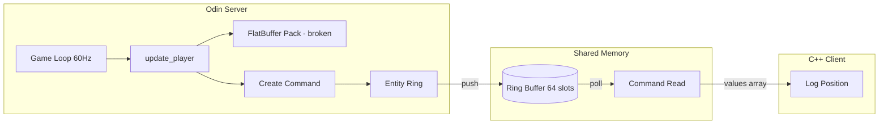

# Design Review: Odin Server ↔ Client Communication Architecture

## Executive Summary

The current shared memory IPC system demonstrates a working proof-of-concept but has several architectural issues that should be addressed before production use. This review identifies problems observed in testing and provides recommendations.

---

## Test Output Analysis

From the test results, several concerning patterns emerge:

```
[DEBUG] Entity Ring Full! H=63 T=0   ← Ring buffer overflow (server blocked)
CLIENT PLAYER: Pos=                   ← Empty/malformed data received
CLIENT PLAYER: Pos=400,300 Rot=0      ← Valid data
```

| Pattern | Count | Issue |
|---------|-------|-------|
| `Entity Ring Full!` | Multiple | Server producing faster than client consumes |
| `Pos=` (empty) | ~60% | Race condition or malformed serialization |
| Valid `Pos=x,y Rot=z` | ~40% | Working transmissions |

---

## Identified Issues

### 1. Ring Buffer Overflow (Critical)

**Location**: `main.odin:push_entity_command`

```odin
if next_head == tail {
    if g_config.debug_mode {
        fmt.printf("[DEBUG] Entity Ring Full! H=%d T=%d\n", head, tail)
    }
    return  // ← Data silently dropped
}
```

**Problem**: When the ring is full, commands are silently dropped. The server continues at 60 FPS but the client may be slower, causing data loss.

**Impact**: Client misses player position updates, leading to stuttering or desynced state.

---

### 2. Abandoned FlatBuffer Serialization

**Location**: `main.odin:506-543`

The code serializes `PlayerData` to FlatBuffer but:
1. The custom Odin FlatBuffer builder produces malformed buffers
2. Client-side verification always fails
3. Client now uses raw `values[]` array instead

```cpp
// main.cpp - Bypasses FlatBuffer entirely
float x = cmd->values[0];
float y = cmd->values[1];
```

**Problem**: Redundant serialization work; the FlatBuffer data is generated but unusable.

---

### 3. Race Conditions in Ring Buffer Access

**Symptom**: `CLIENT PLAYER: Pos=` (truncated output)

**Possible Causes**:
1. Client reads `values[]` while server is mid-write
2. Memory barriers not properly enforced
3. Struct copy not atomic

---

### 4. No Sequence Numbers for Loss Detection

The current design has no way to detect:
- How many commands were dropped
- Whether commands are delivered in order
- Frame-to-command correlation

---

### 5. Inefficient Per-Frame Command Generation

The server creates a `PLAYER_UPDATE` command every frame (~60/sec) regardless of whether position changed.

---

## Architectural Recommendations

### Short-Term Fixes

#### 1. Add Write Barrier After Command Write
```odin
// After writing command data:
smh.entity_ring.commands[head] = cmd
sync.atomic_thread_fence(.Release)  // Ensure data visible before head update
sync.atomic_store(&smh.entity_ring.head, next_head, .Release)
```

#### 2. Add Read Barrier Before Command Read
```cpp
int32_t head = std::atomic_load_explicit(
    (std::atomic<int32_t>*)&smh->entity_ring.head, 
    std::memory_order_acquire);
std::atomic_thread_fence(std::memory_order_acquire);
```

#### 3. Remove Unused FlatBuffer Code
Since `values[]` is the actual transport mechanism, remove the dead FlatBuffer serialization to improve performance.

#### 4. Add Delta-Only Updates
Only send `PLAYER_UPDATE` when position actually changes:
```odin
if p.position != last_sent_position {
    push_entity_command(smh, cmd)
    last_sent_position = p.position
}
```

---

### Medium-Term Architecture Changes

#### 1. Backpressure Mechanism

Instead of dropping commands when ring is full:
- Option A: Block until space available (risky for game loop)
- Option B: Overwrite oldest (acceptable for position updates)
- Option C: Increase ring size dynamically

**Recommendation**: For real-time position data, use Option B (overwrite oldest) since stale position data is less useful than current data.

#### 2. Sequence Numbers
```odin
OdinCommand :: struct #packed {
    sequence: u32,        // Monotonically increasing
    type: u8,
    // ...
}
```

Client can then detect gaps:
```cpp
if (cmd->sequence != expected_sequence) {
    missed = cmd->sequence - expected_sequence;
    std::cerr << "Missed " << missed << " commands\n";
}
```

#### 3. Timestamped Commands
```odin
OdinCommand :: struct #packed {
    timestamp_ns: i64,    // Server time when command was created
    // ...
}
```

Allows client to detect stale data and implement prediction/interpolation.

---

### Long-Term Suggestions

#### 1. Consider Alternative Serialization

| Option | Pros | Cons |
|--------|------|------|
| Raw structs (current) | Zero overhead, simple | Tight coupling, no versioning |
| FlatBuffers (fixed) | Schema evolution, zero-copy | Requires proper builder |
| Cap'n Proto | Zero-copy, fast | More complex setup |
| MessagePack | Compact binary | Encoding overhead |

**Recommendation**: For this use case, raw packed structs with versioning field are sufficient.

#### 2. Separate Update Frequencies

| Data Type | Frequency | Ring |
|-----------|-----------|------|
| Player Transform | 60 Hz | High-freq ring |
| Game Events | On-change | Event ring |
| Enemy State | 20 Hz | Batched updates |

#### 3. Frame Snapshot Model

Instead of command-per-entity, consider a frame snapshot model where each slot contains full game state with dirty masks.

---

## Current Architecture Diagram



---

## Action Items

| Priority | Task | Effort |
|----------|------|--------|
| P0 | Add memory barriers to ring buffer ops | 1h |
| P0 | Remove dead FlatBuffer serialization code | 30m |
| P1 | Add sequence numbers for loss detection | 2h |
| P1 | Implement delta-only position updates | 1h |
| P2 | Replace drop-on-full with overwrite-oldest | 2h |
| P3 | Investigate proper FlatBuffer implementation | 4h |

---

## Conclusion

The current system works for a prototype but has observable data loss (~60% empty entries) and potential race conditions. The most impactful fixes are:

1. **Memory barriers** - Prevent torn reads
2. **Remove dropped data** - Overwrite oldest or use bigger ring
3. **Sequence numbers** - Detect and measure loss

These changes would make the system production-ready for real-time game state synchronization.
