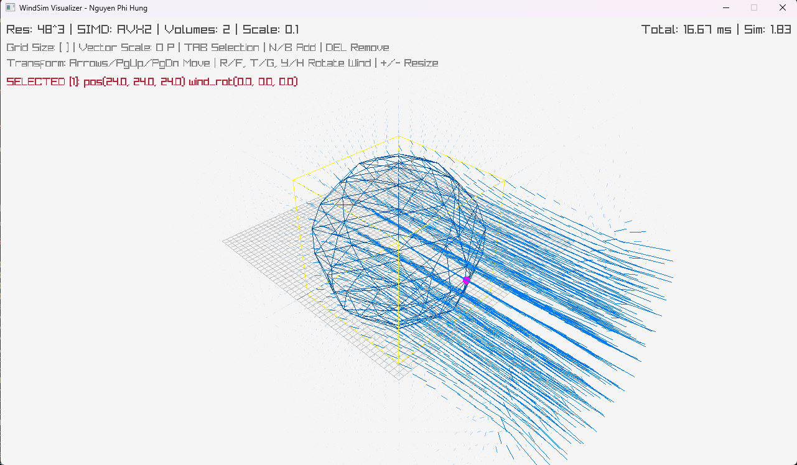

# SandboxDev

A collection of toy projects and experiments created to learn and explore various programming languages and technologies.

## Projects

### [WindSim](./WindSim)
A 3D wind simulation project implemented in C++ and built using the Zig toolchain. 32^3 grid resolution took under 1 seconds to simulate on CPU.

## Author
Nguyen Phi Hung
