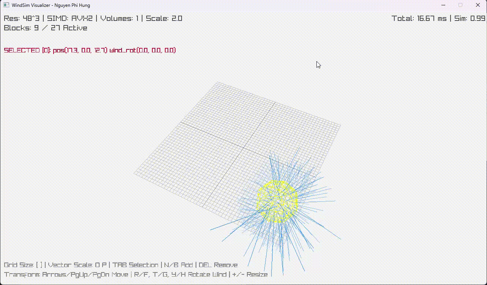
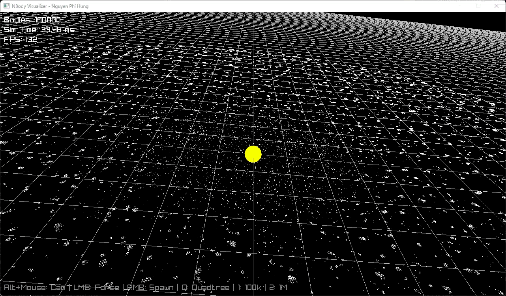
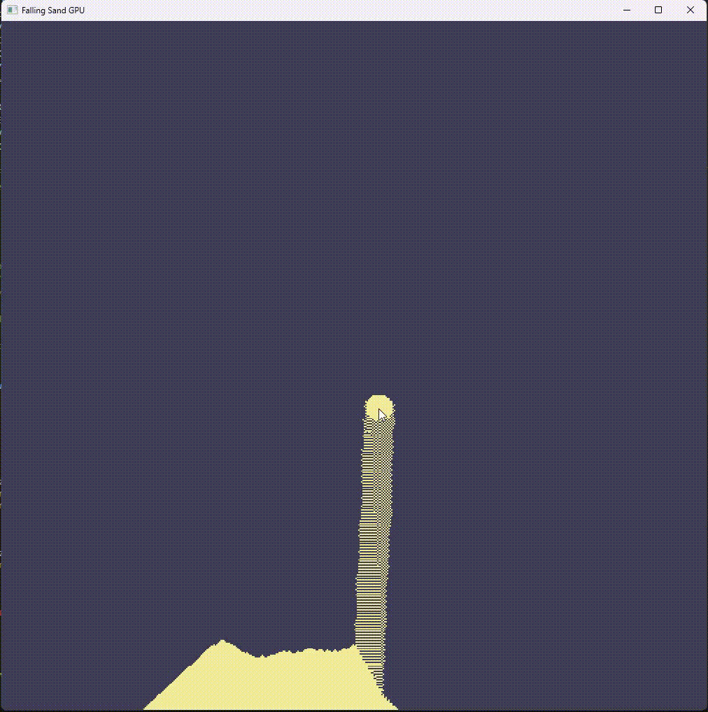

# SandboxDev

A collection of toy projects and experiments created to learn and explore various programming languages and technologies.

## Projects

### [WindSim](./WindSim)
A 3D wind simulation project implemented in C++ and built using the Zig toolchain. 32^3 grid resolution took under 1 seconds to simulate on CPU.
This project also demonstrates using **Zig** to seamlessly interop with **C** (Raylib) for Visualization and **C++** for Physics Engine.

### [N-Body Simulation](./NBody)
A high-performance gravitational N-body simulation using the **Barnes-Hut** algorithm. (main simulation code was taken from https://github.com/DeadlockCode/barnes-hut , credit to the author)
- **Simulation**: Written in **Rust**, parallelized with my job system **RustFiber** ([https://github.com/josephkirk/RustFiber](https://github.com/josephkirk/RustFiber)) for high-throughput physics. A pure Zig Simulation can be toggle for comparision.
- **Visualization**: Built in **Zig** with **Raylib**, using low-level **rlgl** calls for rendering 100k+ bodies at 144+ FPS.
- **Interop**: Zig-Rust FFI with a thin C-compatible API.

### [Vulkan Compute Learning](./VulkanCompute)
A "simple" sand simulation project implemented in **Zig** and built using directly **Vulkan** API to learn how Vulkan and general graphic pipeline work.
All Vulkan codes is verbally commented for learning purposes. The project demonstrate graphic pipeline from compute ( sand sim ) with hlsl to fragment pass writen in glsl for visualization then to compute again in hlsl (TAA) then post-process with CRT effect.
- **Input**: 1 for simple shader, 2 for text shader, 3 to toggle post process

## Author
Nguyen Phi Hung
